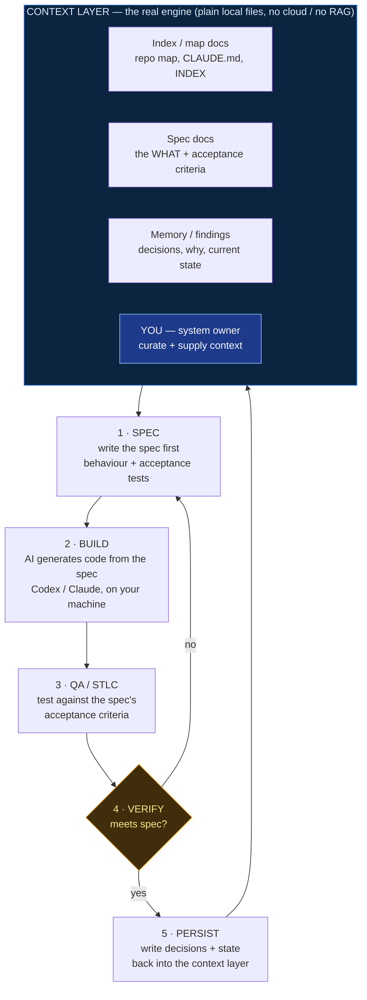
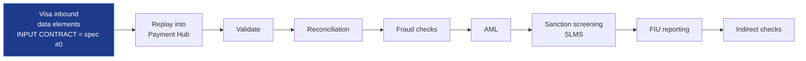

# Spec-Driven Development — the portable workflow (local-first, no cloud needed)

> The engine isn't cloud / Docker / microservices / RAG. It's **curated context on local files + spec-first + a QA loop**, with a human who owns the system model. That's what makes it work — and it's fully replicable on a local machine.

## 1 · The operating loop (how we actually work)

**Why it compounds:** PERSIST writes back into the CONTEXT LAYER, so every cycle the AI gets *better* context for the next spec. No vector DB required — for a bounded project, hand-curated docs give **more precise** context than RAG would. You graduate to RAG only when the repo is too big to hold in curated docs. Not doing RAG yet isn't a gap; it's the right call for an MVP.

## 2 · Same loop, instantiated on Visa EFT (the MVP)

**Each box above = one SPEC → built → QA'd through the loop in §1.** All local. "We're an API project, not microservices" is *fine* — the workflow doesn't care. Start from the Visa data-element contract (spec #0); everything downstream specs off it. Use synthetic/mocked Visa data if real data can't leave the building.

## 3 · The one-line pitch for your workplace
> "SDD = write the spec (behaviour + acceptance tests) before code; let the AI build to the spec; QA against the spec; persist decisions back into the docs so context compounds. Runs on a laptop. The only 'infra' is well-structured docs — and a person who knows the system."

That last clause is you. Not coding it by hand doesn't make you unable to do it — **you're the architect and the context-holder, which is the scarce part.** The proof is the body of non-trivial systems you've personally architected and shipped with this method — your ideas, built this way.
